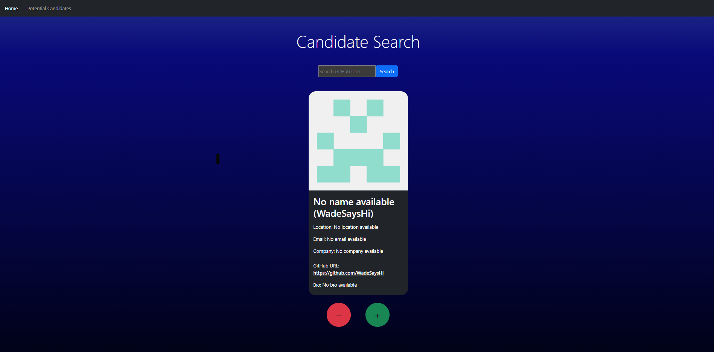

[](https://opensource.org/licenses/MIT)

# Candidate Search

## Description

I built the Candidate Search application to streamline the process of reviewing and managing potential candidates from GitHub, aiming to provide a practical tool for employers to efficiently track and evaluate developer profiles. This project allowed me to integrate API data with a TypeScript and React front end, enhancing my skills in API integration, state management, and TypeScript usage. It also involved utilizing local storage to persist data and deploying the application to Render, which taught me valuable lessons in deploying full-stack applications and ensuring smooth operation in a production environment.

Deployed Link: https://candidate-search-q9zr.onrender.com/

## Table of Contents

- [Installation](#installation)
- [Usage](#usage)
- [License](#license)
- [Contributing](#contributing)
- [Tests](#tests)
- [Questions](#questions)

## Installation

1. Clone the Repository:
   ```bash
   git clone [REPOSITORY_URL]
   cd [REPOSITORY_NAME]
   ```
2. Create a GitHub Personal Access Token

3. Add the token to the .env file

4. Install dependencies
   ```bash
   npm install
   ```
5. Run the application
   ```bash
   npm run dev
   ```
6. Open the browser on the local host

## Usage

1. **Start the Application:**

   - Follow the Installation Instructions to set up and run the application.

2. **Search for a Candidate:**

   - On the main page, enter a GitHub username into the search input field and click the "Search" button.
   - Example: Enter `octocat` and click "Search".

3. **View Candidate Information:**

   - The application will display information for the searched candidate, including their name, username, location, avatar, email, GitHub URL, company, and bio.

4. **Save a Candidate:**

   - Click the "+" button to save the currently displayed candidate to the list of potential candidates.
   - After saving, the application will automatically display the next candidate's information.

5. **Move to Next Candidate:**

   - Click the "-" button to move to the next candidate without saving the current one.

6. **View Saved Candidates:**

   - Navigate to the "Saved Candidates" page to view a list of previously saved candidates.
   - Each saved candidate entry includes their name, username, location, avatar, email, GitHub URL, company, and bio.

7. **Handle No More Candidates:**
   - If there are no more candidates available, the application will show a message indicating that no more candidates are available.

### Examples

#### Example 1: Search for a Candidate

- **Input:** `octocat`
- **Result:** Displays information for the GitHub user `octocat`.

#### Example 2: Save a Candidate

- After searching for a candidate and viewing their details, click the "+" button to save them.
- **Action:** The candidate's information is added to the list of potential candidates.

#### Example 3: Move to Next Candidate

- Click the "-" button to view the next candidate.
- **Action:** The application displays information for the subsequent candidate in the list.

#### Example 4: View Saved Candidates

- Navigate to the "Saved Candidates" page.
- **Result:** Lists all saved candidates with their details.



## License

This project is licensed under the MIT license.

## Contributing

### Collaborator

- **Charlie Puente** - edX tutor who provided guidance and feedback during the project.

### Third-Party Assets

- **Bootstrap**: A popular front-end framework for building responsive, mobile-first websites. [Bootstrap](https://getbootstrap.com/)
- **React**: A JavaScript library for building user interfaces. [React](https://reactjs.org/)
- **TypeScript**: A strongly typed programming language that builds on JavaScript. [TypeScript](https://www.typescriptlang.org/)
- **GitHub API**: Provides access to GitHub data, including user profiles. [GitHub API Documentation](https://docs.github.com/en/rest/users/users)
- **Vite**: A build tool that provides a fast development environment. [Vite](https://vitejs.dev/)
- **Render**: A platform for deploying applications with ease. [Render Deployment Guide](https://coding-boot-camp.github.io/full-stack/render/render-deployment-guide)

## Tests

1. **Start the Application**

   - Ensure the application is running locally:
     ```bash
     npm dev
     ```

2. **Test Candidate Search**

   - Open your browser and navigate to the localhost.
   - Verify that the Candidate Search page loads correctly.
   - Enter a GitHub username in the search input and click the search button.
   - Check that candidate information (name, username, location, etc.) is displayed.

3. **Test Navigation**

   - Click the "+" button to save the candidate and ensure the next candidate's information is displayed.
   - Click the "-" button to view the next candidate without saving the current one.
   - Verify that saved candidates appear on the Potential Candidates page.

4. **Test Persistence**
   - Refresh the browser and verify that the list of potential candidates is retained.
   - Check that the list updates correctly when candidates are added or removed.

### 2. Example Usage

1. **Search for a Candidate**

   - Enter a GitHub username (e.g., `octocat`) in the search input field.
   - Click the "Search" button to display the candidate's details.

2. **Manage Candidates**

   - Use the "+" button to add a candidate to the list.
   - Use the "-" button to skip to the next candidate.

3. **View Saved Candidates**
   - Navigate to the Potential Candidates page to see the list of saved candidates.
   - Verify that each saved candidate's information is correctly displayed.

## Questions

Please visit my GitHub profile: https://github.com/RoryDowse.<br>
For additional questions, please contact me at: rorydowse@hotmail.com.
